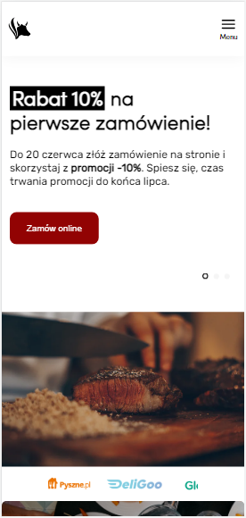

# Steak house
This is a website of a restaurant made on the mockup pattern from https://www.figma.com/file/7v0bTZcKyIO1BEcluPuZp9/Steak_house?node-id=1%3A2.  
The main goal of the project was to build a fully responsive web application using HTML, SCSS and JS technology.

| Desktop view   | Mobile view |
|  :---:          |     :---:     |
| | |
## How to deploy
* To get started clone [repository](https://github.com/pressR2/Steak-House.git).
* Install all project dependencies with `npm install`.
* Start the development server with `npm start`.
### Requirements
[Node.js](https://nodejs.org)
### Dependencies
* This project was bootstrapped with [Create React App](https://github.com/facebook/create-react-app)
* [react-responsive](https://github.com/contra/react-responsive)
* [sass](https://sass-lang.com/)
* [swiper](https://swiperjs.com/)

#Icons close.svg and menu.svg were taken from https://freeicons.io/.
